# 🎬 CinemaVerse

A modern full-stack movie ticket booking platform that enables users to discover movies, explore showtimes, reserve seats, make secure online payments, and receive automated booking confirmations. The application also provides an admin dashboard for managing shows, bookings, and platform analytics.

<p align="center">


</p>

---

# 🌐 Live Demo

Experience **CinemaVerse** live and explore the complete movie ticket booking workflow—from authentication and movie discovery to secure Stripe payments, automated email confirmations, and the powerful admin dashboard.

<p align="center">
  <a href="https://cinemaverse-three.vercel.app/" target="_blank">
    
  </a>
</p>

<p align="center">
  <strong>🔗 Live URL</strong><br>
  👉 <a href="https://cinemaverse-three.vercel.app/">
    https://cinemaverse-three.vercel.app/
  </a>
</p>

> **💳 Stripe Test Mode:** Payments are processed using **Stripe Test Mode**. Use Stripe's official test card details to simulate successful transactions.

---

# 🎬 Demo Preview

Get a quick preview of the complete CinemaVerse experience in just **25 seconds**.

<p align="center">
  
</p>

<p align="center">
  <i>
    Browse Movies • View Details • Watch Trailer • Select Seats • Stripe Checkout • Booking History • Favorites • Admin Dashboard
  </i>
</p>

---

# 🎥 Full Application Walkthrough

Watch the complete **2-minute end-to-end demonstration** showcasing every major feature of CinemaVerse.

<p align="center">
  <a href="https://github.com/user-attachments/assets/47d5c05e-a391-4ad2-beda-7a412c39a66e" target="_blank">
    
  </a>
</p>

<p align="center">
  <strong>🎥 Video URL</strong><br>
  <a href="https://github.com/user-attachments/assets/47d5c05e-a391-4ad2-beda-7a412c39a66e">
    👉 🔗 https://github.com/user-attachments/assets/47d5c05e-a391-4ad2-beda-7a412c39a66e
  </a>
</p>

<p align="center">
  <sub>
    ✔ Authentication &nbsp;•&nbsp;
    ✔ Movie Discovery &nbsp;•&nbsp;
    ✔ Trailer Playback &nbsp;•&nbsp;
    ✔ Seat Selection &nbsp;•&nbsp;
    ✔ Stripe Checkout &nbsp;•&nbsp;
    ✔ Booking History &nbsp;•&nbsp;
    ✔ Favorites &nbsp;•&nbsp;
    ✔ Admin Dashboard &nbsp;•&nbsp;
    ✔ Add Shows &nbsp;•&nbsp;
    ✔ Manage Shows
  </sub>
</p>

---

# 📸 Application Screenshots
Take a look at some of the key user and admin experiences that CinemaVerse offers.

| 🏠 Home Page | 🎬 Movies |
|--------------|-----------|
| 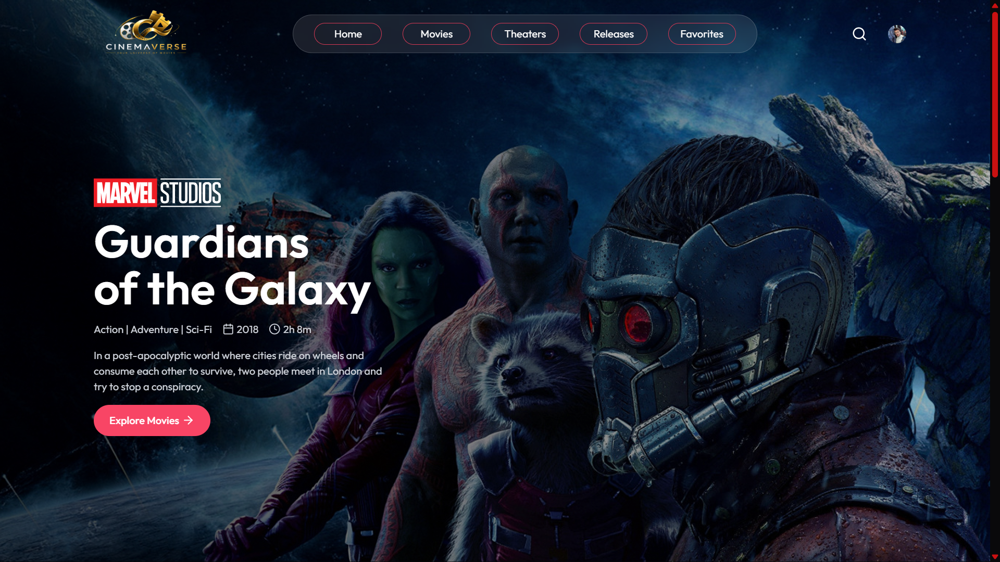 | 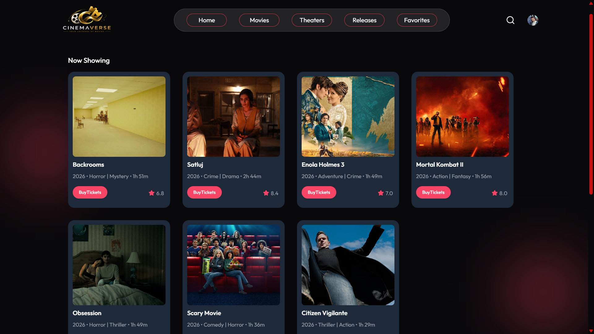 |

| 🆕 Latest Releases | 🎥 Trailer Experience |
|--------------------|-----------------------|
| 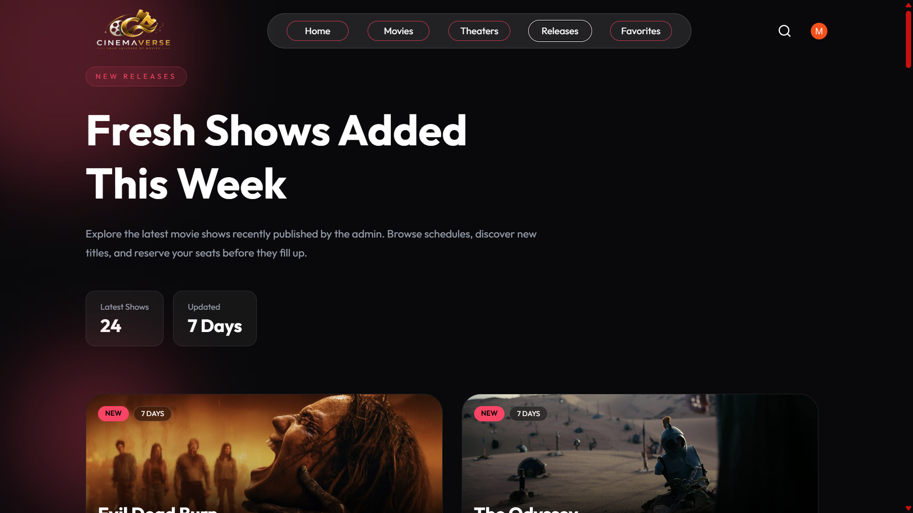 | 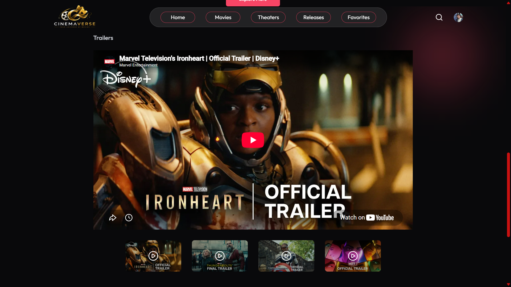 |

| 🎞 Movie Details | 💺 Seat Selection |
|------------------|-------------------|
| 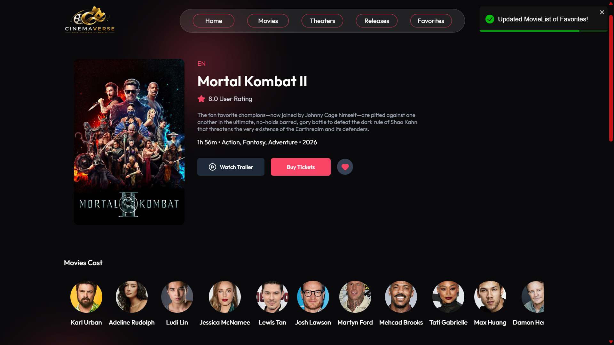 | 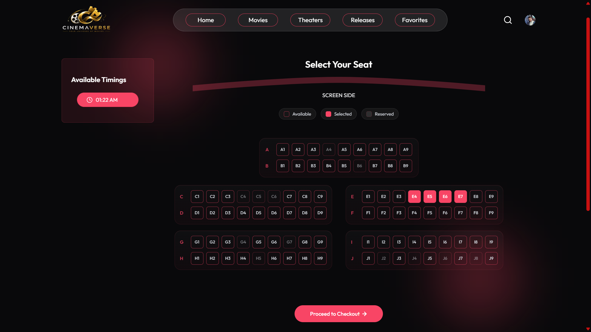 |

| 💳 Stripe Checkout | 📖 My Bookings |
|---------------------|----------------|
| 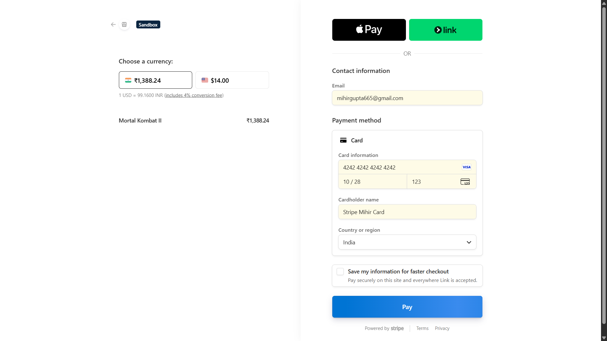 | 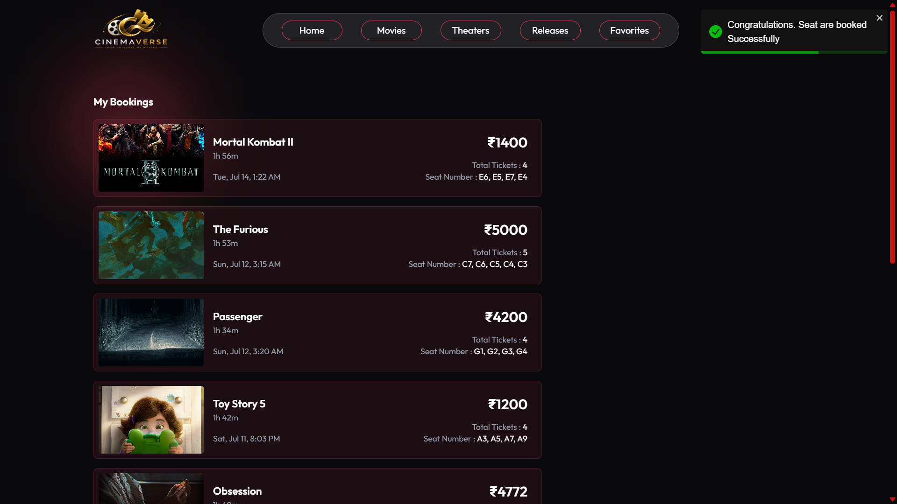 |

| ❤️ Favorites | 📊 Admin Dashboard |
|---------------|--------------------|
| 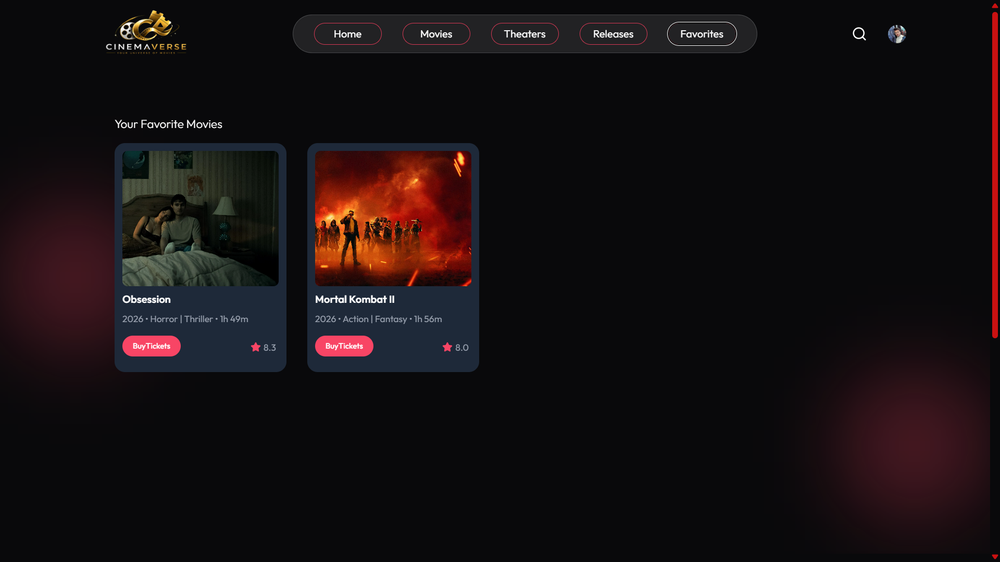 | 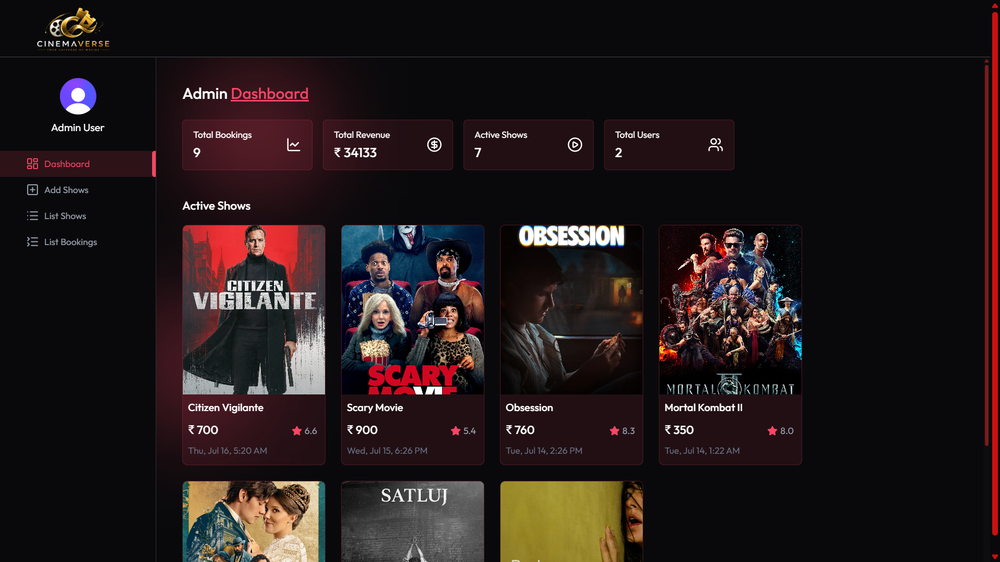 |

| ➕ Add Show | 🎬 Manage Shows |
|-------------|-----------------|
| 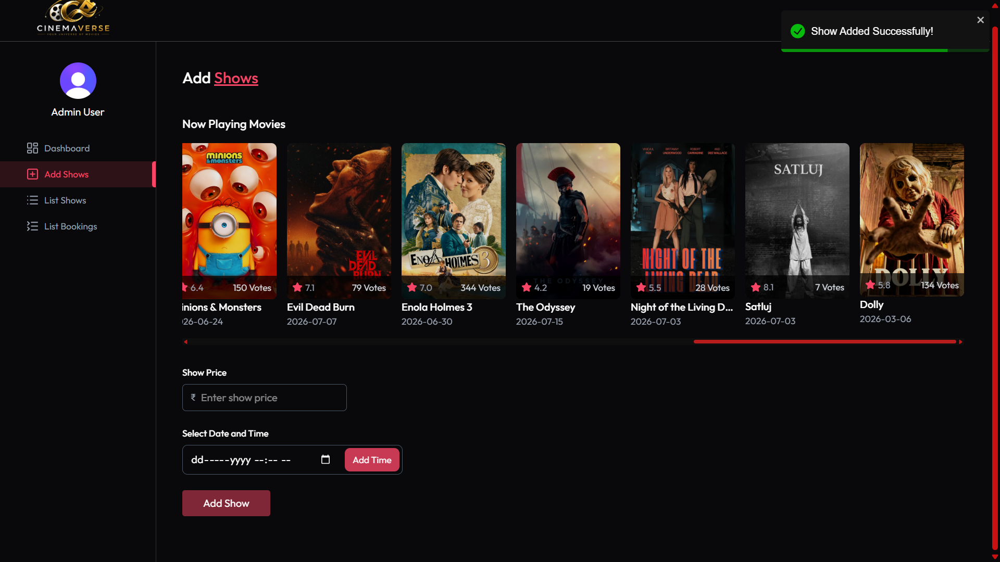 | 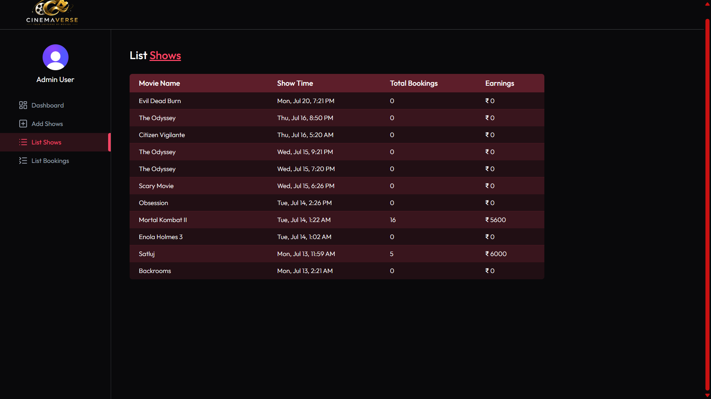 |

---

# ✨ Features

## 👤 User Features

- Browse latest and featured movies
- View complete movie information
- Watch official trailers
- Explore cast and movie details
- Select preferred date and show timing
- Interactive seat selection
- Secure Stripe Checkout
- Receive booking confirmation email
- View booking history
- Manage favourite movies
- Clerk authentication
- Responsive UI across devices

---

## 🛠 Admin Features

- Secure admin dashboard
- Add new movie shows
- TMDB movie integration
- View all active shows
- Monitor total bookings
- Track platform revenue
- View registered users
- Booking management

---

# 🚀 Tech Stack

## Frontend

- React 19
- Vite
- React Router DOM
- Tailwind CSS
- Axios
- React Toastify
- Lucide React
- React Player

---

## Backend

- Node.js
- Express.js
- MongoDB Atlas
- Mongoose
- Clerk Authentication
- Stripe Payment Gateway
- Stripe Webhooks
- Inngest
- Nodemailer
- TMDB API

---

#  Project Architecture

```
                   React Frontend
                         │
                         │
                 REST API Requests
                         │
                         ▼
                  Express Backend
                         │
      ┌────────────┬──────────────┬─────────────┐
      │            │              │             │
      ▼            ▼              ▼             ▼
 MongoDB       Clerk Auth      TMDB API      Stripe
                                              │
                                              ▼
                                      Stripe Webhook
                                              │
                                              ▼
                                           Inngest
                                              │
                                              ▼
                                    Email Notifications
```

---

# 📁 Project Structure

```
CinemaVerse/
│
├── client/
│   ├── public/
│   ├── src/
│   │   ├── assets/
│   │   ├── components/
│   │   ├── context/
│   │   ├── lib/
│   │   ├── pages/
│   │   ├── App.jsx
│   │   └── main.jsx
│   └── package.json
│
├── server/
│   ├── configs/
│   ├── controllers/
│   ├── inngest/
│   ├── middlewares/
│   ├── models/
│   ├── routes/
│   ├── server.js
│   └── package.json
│
└── README.md
```

---

# ⚙️ Key Functionalities

### Authentication

- Secure sign-in/sign-up using Clerk
- Protected routes
- User session management

### Movie Management

- Movie details fetched from TMDB API
- Automatic movie information
- Trailer support
- Cast information

### Booking System

- Date selection
- Show selection
- Seat reservation
- Prevent double booking
- Booking history

### Payment Gateway

- Stripe Checkout
- Secure payment processing
- Webhook verification
- Booking confirmation after successful payment

### Email Automation

- Booking confirmation email
- Ticket details
- Background processing using Inngest

### Admin Dashboard

- Dashboard analytics
- Revenue tracking
- Booking management
- Show management

---

# 🔐 Environment Variables

## Client (.env)

```env
VITE_BASE_URL=http://localhost:3000

VITE_TMDB_IMAGE_BASE_URL=https://image.tmdb.org/t/p/original

VITE_CLERK_PUBLISHABLE_KEY=YOUR_CLERK_KEY

VITE_CURRENCY=INR
```

---

## Server (.env)

```env
MONGODB_URI=YOUR_MONGODB_URI

TMDB_API_KEY=YOUR_TMDB_API_KEY

CLERK_SECRET_KEY=YOUR_CLERK_SECRET_KEY

STRIPE_SECRET_KEY=YOUR_STRIPE_SECRET_KEY

STRIPE_WEBHOOK_SECRET=YOUR_STRIPE_WEBHOOK_SECRET

SMTP_USER=YOUR_SMTP_USER

SMTP_PASS=YOUR_SMTP_PASSWORD

SENDER_EMAIL=YOUR_EMAIL
```

---

# 💻 Installation

Clone the repository

```bash
git clone https://github.com/yourusername/CinemaVerse.git
```

Move into the project

```bash
cd CinemaVerse
```

Install frontend dependencies

```bash
cd client

npm install
```

Install backend dependencies

```bash
cd ../server

npm install
```

---

# ▶ Running the Project

Start Backend

```bash
npm run server
```

Start Frontend

```bash
cd client

npm run dev
```

Frontend

```
http://localhost:5173
```

Backend

```
http://localhost:3000
```

---

# 📦 Available Scripts

## Client

```bash
npm run dev
```

Runs Vite Development Server.

```bash
npm run build
```

Creates Production Build.

```bash
npm run preview
```

Preview Production Build.

```bash
npm run lint
```

Run ESLint.

---

## Server

```bash
npm run server
```

Runs Backend with Nodemon.

```bash
npm start
```

Runs Backend using Node.

---

# 🔄 Booking Workflow

```
User Login
      │
      ▼
Browse Movies
      │
      ▼
Select Show
      │
      ▼
Choose Seats
      │
      ▼
Stripe Checkout
      │
      ▼
Payment Success
      │
      ▼
Webhook Verification
      │
      ▼
Booking Stored
      │
      ▼
Email Sent
```

---

# 🚀 Deployment

### Frontend

- Vercel

### Backend

- Render

### Database

- MongoDB Atlas

### Payments

- Stripe Webhooks

### Emails

- Node Mailer

### Automation

- Inngest

---


# 🤝 Contributing

Contributions are welcome.

1. Fork the repository

2. Create a feature branch

```bash
git checkout -b feature-name
```

3. Commit changes

```bash
git commit -m "Added feature"
```

4. Push changes

```bash
git push origin feature-name
```

5. Open a Pull Request

---

# 📄 License

This project is page only for education and learning purpose.

---

# 👨‍💻 Author

**Mihir Gupta**

If you found this project helpful, consider giving it a ⭐ on GitHub.